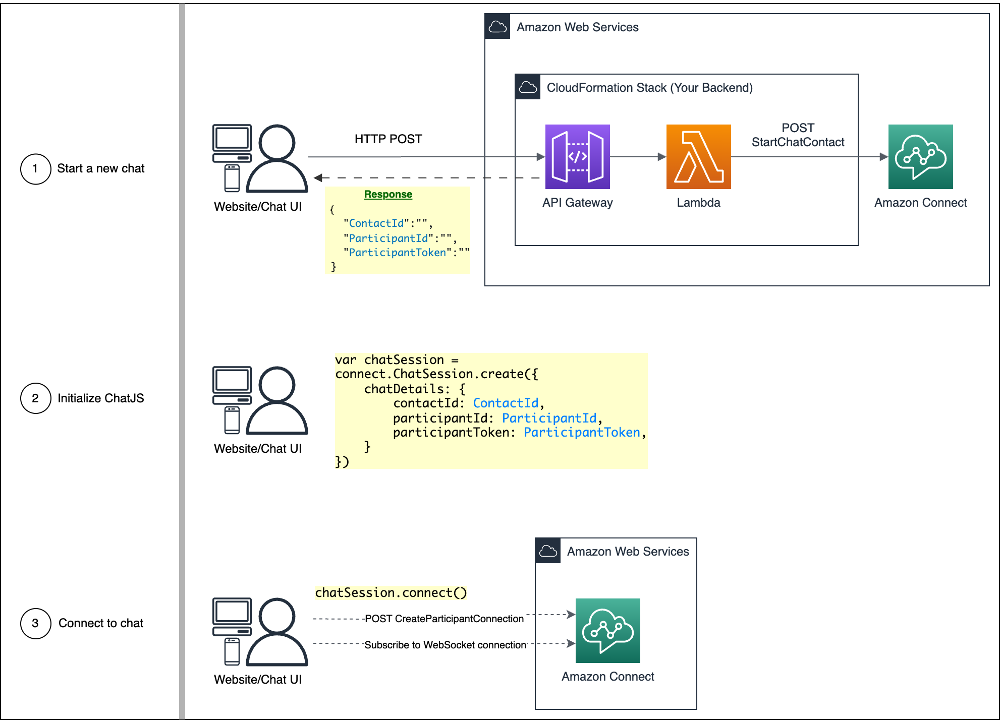
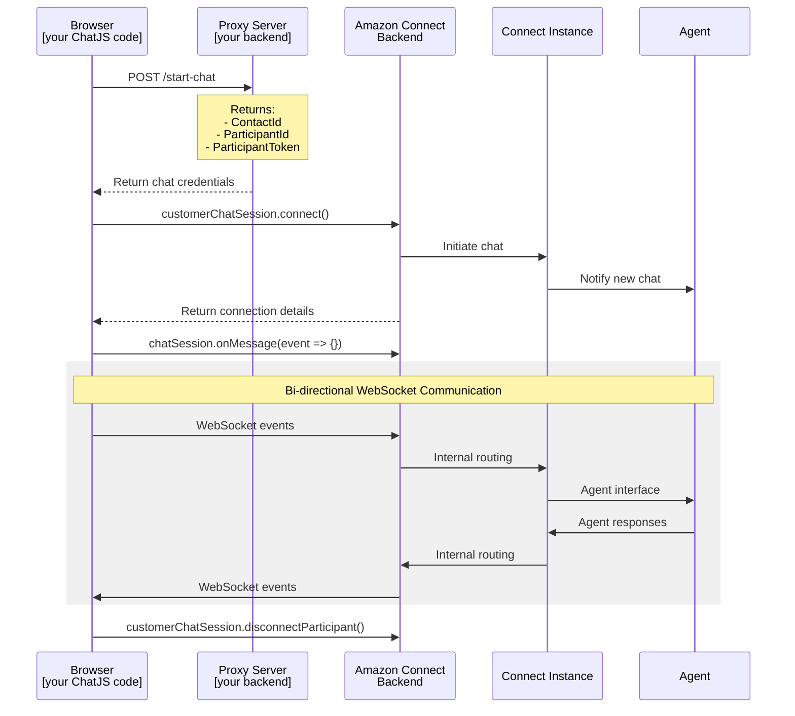

# Amazon Connect ChatJS

[](https://www.npmjs.com/package/amazon-connect-chatjs) [](https://opensource.org/licenses/Apache-2.0)  

A browser-based JavaScript library for building chat interfaces for [Amazon Connect](https://docs.aws.amazon.com/connect/latest/adminguide/what-is-amazon-connect.html) with TypeScript support, AWS SDK integration for API calls, and WebSocket connection management. The library also supports custom builders for agent chat interfaces when integrated with [Amazon Connect Streams](https://github.com/aws/amazon-connect-streams).

📢 **New to Amazon Connect?** Start with the [pre-built Hosted Widget](https://docs.aws.amazon.com/connect/latest/adminguide/add-chat-to-website.html) before customizing with this library.



## Quick Links

- [Annoucements](#announcements)
- [Getting Started](#getting-started)
- [API Reference](#api-reference)
- [Feature Documentation](#features)
- [Example Code](#example-code)
- [Common Problems & Solutions](#common-problems--solutions)

## Announcements

- **2024-04-02**: Connection Acknowledgement (ConnAck) has migrated from [SendEvent](https://docs.aws.amazon.com/connect-participant/latest/APIReference/API_SendEvent.html) API to the [CreateParticipant](https://docs.aws.amazon.com/connect-participant/latest/APIReference/API_CreateParticipantConnection.html) API. Please upgrade to `amazon-connect-chatjs@^1.4.0` by **Dec 31, 2024**
- **2023-03-30**: v1.5.0 - Added support for _React Native environments_
- **2023-12-23**: v1.3.0 - Added Message Receipts (enabled by default, turn off with `.create(features: { messageReceipts: { shouldSendMessageReceipts: true })`
- **2022-11-08**: v1.2.0 - Added Client Side Metrics (CSM) (enabled by default, turn off with `.create({ disableCSM })` flag)
- **2020-12-13**: Added support for TypeScript (requires `typescript@^3.0.1` or higher)

## Getting Started

### Prerequisites

- An [AWS Account](https://aws.amazon.com/console/)
- An Amazon Connect instance set up in your account - [Create an Amazon Connect instance](https://docs.aws.amazon.com/connect/latest/adminguide/amazon-connect-instances.html)

### Installation

```sh
npm install amazon-connect-chatjs
# or
yarn add amazon-connect-chatjs
# or
pnpm add amazon-connect-chatjs
```

### Usage (Customer Chat)

Create and join new chat session. First, make a request to your backend where you'll call [StartChatContact](https://docs.aws.amazon.com/connect/latest/APIReference/API_StartChatContact.html) API (SigV4). Then, return the newly created chat details (`{ ContactId, ParticipantId, ParticipantToken }`) to the client and initialize ChatJS.

> - For **local testing**, see the [local-testing/](./local-testing/) sample.
> - For **production**, use your backend or deploy a Lambda with this [sample CloudFormation stack](https://github.com/amazon-connect/amazon-connect-chat-ui-examples/tree/master/cloudformationTemplates/startChatContactAPI).

```typescript
// Client-side code
import "amazon-connect-chatjs"; // imports the "window.connect" class

connect.ChatSession.setGlobalConfig({ region: "us-west-2" });

// Step 1: Get chat details from your backend
const response = await fetch("<url-to-personal-chat-backend>", { method: "POST" });
const chatDetails = await response.json();

// Step 2: Connect to the chat session
const customerChatSession = connect.ChatSession.create({
  chatDetails: {
    contactId: chatDetails.ContactId,
    participantId: chatDetails.ParticipantId,
    participantToken: chatDetails.ParticipantToken,
  },
  options: { region: "us-west-2" }, // optional
  type: "CUSTOMER",
  disableCSM: true
});
await customerChatSession.connect();

// Step 3: Send messages and events
await customerChatSession.sendMessage({ contentType: "text/plain", message: "Hello World!" });
await customerChatSession.sendEvent({ contentType: "application/vnd.amazonaws.connect.event.typing" });

// Step 4: Handle incoming websocket events
customerChatSession.onMessage(event => { /* ... */ });
customerChatSession.onConnectionBroken(event => { /* ... */ });
customerChatSession.onEnded(event => { /* ... */ });
customerChatSession.onTyping(event => { /* ... */ });
customerChatSession.onConnectionEstablished(event => { /* ... */ });

// Step 5: End chat gracefully
await customerChatSession.disconnectParticipant();
```

<details>
  <summary>📌 Alternative: HTML Implementation for ChatJS</summary>

```html
<!DOCTYPE html>
<html>
<head>
  <meta charset="UTF-8">
  <!--
  Alternative import method:
  <script src="https://unpkg.com/amazon-connect-chatjs@3.0.3"></script>
  -->
</head>
<body>
  <div id="chat-container">
    <!-- Chat UI elements would go here -->
  </div>

  <script type="module">
    import "https://unpkg.com/amazon-connect-chatjs@3.0.3";
    const REGION = "us-west-2";

    window.onload = async function () {
      // Configure ChatJS
      connect.ChatSession.setGlobalConfig({ region: REGION });

      // Step 1: Get chat details from your backend
      const response = await fetch("<url-to-personal-chat-backend>", { method: "POST" });
      const chatDetails = await response.json();

      // Step 2: Connect to the chat session
      const customerChatSession = connect.ChatSession.create({
        chatDetails: {
          contactId: chatDetails.ContactId,
          participantId: chatDetails.ParticipantId,
          participantToken: chatDetails.ParticipantToken,
        },
        options: { region: REGION }, // optional
        type: "CUSTOMER",
        disableCSM: true
      });
      await customerChatSession.connect();

      // Step 3: Send messages and events
      // These would typically be triggered by user actions
      // await customerChatSession.sendMessage({ contentType: "text/plain", message: "Hello World!" });
      // await customerChatSession.sendEvent({ contentType: "application/vnd.amazonaws.connect.event.typing" });

      // Step 4: Handle incoming websocket events
      customerChatSession.onMessage(event => { /* ... */ });
      customerChatSession.onConnectionBroken(event => { /* ... */ });
      customerChatSession.onEnded(event => { /* ... */ });
      customerChatSession.onTyping(event => { /* ... */ });
      customerChatSession.onConnectionEstablished(event => { /* ... */ });

      // Step 5: End chat gracefully
      // This would typically be triggered by a user action
      // await customerChatSession.disconnectParticipant();
    };
  </script>
</body>
</html>
```
</details>

<details>
  <summary>📌 View: Customer Chat Sequence Diagaram</summary>
  

</details>

### Usage with StreamsJS (Agent Chat)

Use **ChatJS** and [**StreamsJS**](https://github.com/amazon-connect/amazon-connect-streams) to manage Agent chat sessions.

> **Note:** Allow-list your domain (including `http://localhost:PORT` for local testing) before using StreamsJS. [Details here](https://github.com/amazon-connect/amazon-connect-streams?tab=readme-ov-file#allowlisting).

```typescript
import 'amazon-connect-streams';  // StreamJS must be imported first
import 'amazon-connect-chatjs';

// Note: StreamJS requires allowlisting an endpoint (e.g., `http://localhost:8080`)
// See: https://github.com/amazon-connect/amazon-connect-streams#allowlisting
const INSTANCE_URL = "https://<INSTANCE_NAME>.my.connect.aws/ccp-v2/";
const REGION = 'us-west-2';

// Step 1: Initialize CCP
// <div id="prebuilt-agent-ui-iframe" />
//const containerElement = document.getElementById("prebuilt-agent-ui-iframe");
await connect.core.initCCP(containerElement: HTMLElement, {
  ccpUrl: INSTANCE_URL,
  region: REGION,
  loginPopup: true,
});

// Step 2: Configure ChatJS (optional)
connect.ChatSession.setGlobalConfig({ /* ... */ });

// Step 3: Handle chat contacts
connect.contact((contact: connect.Contact) => {
  if (contact.getType() !== connect.ContactType.CHAT) return;

  contact.onAccepted(async () => {
    const agentConnection = contact.getConnections().find(conn => conn.getType() === connect.ConnectionType.AGENT);

    // Step 4: Get chat session
    // Option 1: Default
    const agentChatSession = await agentConnection.getMediaController();

    // Option 2: Customizations
    // const agentChatSession = connect.ChatSession.create({
    //   chatDetails: agentConnection.getMediaInfo(), // REQUIRED
    //   options: {
    //     region: REGION, // REQUIRED, must match the value provided to `connect.core.initCCP()`
    //   },
    //   type: connect.ChatSession.SessionTypes.AGENT, // REQUIRED
    //   websocketManager: connect.core.getWebSocketManager() // REQUIRED
    //   disableCSM: true
    // });

    // Step 5: Set up event listeners
    agentChatSession.onConnectionEstablished((event: any) => {
      // Handle connection established
    });

    agentChatSession.onMessage((event: any) => {
      const message = event.data?.Content;
      // Handle incoming message
    });

    // Step 6: Send message (example)
    await agentChatSession.sendMessage({ contentType: "text/plain", message: "Hello World!" });
  });
});
```

<details>
  <summary>📌 Alternative: HTML Implementation for ChatJS + StreamsJS</summary>

```html
<!DOCTYPE html>
<html>
<head>
  <meta charset="UTF-8">
  <!--
  Alternative import method:
  <script src="https://unpkg.com/amazon-connect-streams@2.18.1"></script>
  <script src="https://unpkg.com/amazon-connect-chatjs@3.0.3"></script>
  -->
</head>
<body>
  <div id="prebuilt-agent-ui-iframe" style="width: 400px; height: 800px;"></div>
  <div id="my-custom-agent-chat-ui" style="width: 400px; height: 800px;">
    <div id="custom-agent-chat-transcript">
      <button id="sendMessageButton">Send Message</button>
    </div>
  </div>

  <script type="module">
    import "https://unpkg.com/amazon-connect-streams@2.18.1"; // StreamJS must be imported first
    import "https://unpkg.com/amazon-connect-chatjs@3.0.3";

    // Note: StreamJS requires allowlisting an endpoint (e.g., `http://localhost:8080`)
    // See: https://github.com/amazon-connect/amazon-connect-streams#allowlisting
    const INSTANCE_URL = "https://<INSTANCE_NAME>.my.connect.aws/ccp-v2/";
    const REGION = 'us-west-2';

    window.onload = async function () {
      const prebuiltAgentUIRootElem = document.getElementById("prebuilt-agent-ui-iframe");
      const customAgentUITranscriptElem = document.getElementById("my-custom-agent-chat-ui");
      const sendMessageButton = document.getElementById("sendMessageButton");

      // Configure CCP iframe
      await connect.core.initCCP(prebuiltAgentUIRootElem, {
        ccpUrl: INSTANCE_URL,
        region: REGION,
        loginPopup: true,
      });

      // (optional) Configure ChatJS
      connect.ChatSession.setGlobalConfig({ /* ... */ })

      connect.contact(contact => {
        if (contact.getType() !== connect.ContactType.CHAT) return;

        contact.onAccepted(async () => {
          const agentConnection = contact.getConnections().find(conn => conn.getType() === connect.ConnectionType.AGENT);

          // Option 1: Default
          const agentChatSession = await agentConnection.getMediaController();

          // Option 2: Customizations
          // const agentChatSession = connect.ChatSession.create({
          //   chatDetails: agentConnection.getMediaInfo(), // REQUIRED
          //   options: {
          //     region: REGION, // REQUIRED, must match the value provided to `connect.core.initCCP()`
          //   },
          //   type: connect.ChatSession.SessionTypes.AGENT, // REQUIRED
          //   websocketManager: connect.core.getWebSocketManager() // REQUIRED
          //   disableCSM: true
          // });

          agentChatSession.onConnectionEstablished(event => {
            sendMessageButton.addEventListener('click', async () => {
              await agentChatSession.sendMessage({ contentType: "text/plain", message: "Hello World!" });
            });
          });

          agentChatSession.onMessage(event => {
            let pElement = document.createElement("p");
            pElement.textContent = event.data?.Content;
            customAgentUITranscriptElem.appendChild(pElement);
          });
        });
      });
    };
  </script>
</body>
</html>
```
</details>

## Importing Adjacent AWS-SDK

When using ChatJS with other AWS SDK libraries, maintain this import order:

```js
import 'amazon-connect-streams';     // Optional: MUST be before ChatJS
import 'amazon-connect-chatjs';      // Imports global 'window.connect'
import { ConnectClient } from '@aws-sdk/client-connect';
import { ConnectParticipantClient } from '@aws-sdk/client-connectparticipant';
```
> Note: ChatJS includes a baked-in dependency `@aws-sdk/clients/connectparticipant` (AWS SDK for Javascript v3). When using additional AWS SDK libraries, always import them after ChatJS to avoid conflicts.
> ref: [aws-sdk-connectparticipant.js](https://github.com/amazon-connect/amazon-connect-chatjs/blob/master/src/client/aws-sdk-connectparticipant.js)

## API Reference

- [Global Properties](#global-properties)
- [ChatSession Class](#chatsession-class)
- [`chatSession` Methods](#chatsession-methods)
- [`chatSession` Events](#chatsession-events)

### Global Properties

#### `window.connect.ChatSession`

```js
window.connect.ChatSession = {
  create: ({ /* ... */ }) => {},
  setGlobalConfig: (config) => {},
  LogLevel: { /* ... */ },
  Logger: { /* ... */ },
  SessionTypes: { /* ... */ },
};
```
This is the main entry point to `amazon-connect-chatjs`.
All your interactions with the library start here.

#### `window.connect.LogLevel`

```js
window.connect.LogLevel = {
  DEBUG,
  INFO,
  WARN,
  ERROR,
  ADVANCED_LOG,
};
```
Enumerates the logging levels.

<!--
#### `window.connect.csmService` [INTERNAL ONLY]

```js
const csmService = window.connect.csmService;

// Example usage
csmService.initializeCSM();
csmService.addCountAndErrorMetric(metricName, "UI" || "API", error=false);
csmService.addCountMetric(method, "UI" || "API");
// ...
```
Used for publishing client-side-metrics (CSM) to track API metrics (count, latency, error count). Only applies to `CustomerChatSession`.

Used internally and safe to disable: `connect.ChatSession.create({ ..., disableCSM: true })`. ChatJS will functionally normally without CSM.
-->

### ChatSession Class

#### `connect.ChatSession.create()`

```js
const chatSession = await connect.ChatSession.create({
  chatDetails: {
    contactId: "...", // REQUIRED
    participantId: "...", // REQUIRED
    participantToken: "...", // REQUIRED
  },
  options: {
    region: "us-east-1", // (optional) defaults to `region` set in `.setGlobalConfig()`
  },
  type: window.connect.ChatSession.SessionTypes.CUSTOMER, // REQUIRED - options: `CUSTOMER`, `AGENT`
  disableCSM: true
});
```

`ContactId`, `ParticipantId`, and `ParticipantToken` must be generated on your backend and passed to the client. Make a request to [StartChatContact](https://docs.aws.amazon.com/connect/latest/APIReference/API_StartChatContact.html) API (see [#Usage](#usage-customer-chat)) for more details.

#### `connect.ChatSession.setGlobalConfig()`

```js
connect.ChatSession.setGlobalConfig({
  region: "${config.Region}", // (optional), defaults to: "us-west-2"
  loggerConfig: { // (optional)
    advancedLogWriter: null,
    customizedLogger: {
      debug: (...msg) => console.log(...msg),
      info: (...msg) => console.log(...msg),
      warn: (...msg) => console.log(...msg),
      error: (...msg) => console.log(...msg)
    },
    level: connect.LogLevel.INFO, // (optional), default 10 (DEBUG, INFO, WARN, ERROR, ADVANCED_LOG)
  },
  webSocketManagerConfig: { // (optional)
    isNetworkOnline: customNetworkStatusCheck(), // default: `() => navigator.onLine` (will break in React Native)
  },
  features: { // (optional)
    messageReceipts: {
      shouldSendMessageReceipts: true, // enabled by default, set to false to disable Read/Delivered receipts
      throttleTime: 5000 // default: 5000, customize time to wait before sending Read/Delivered receipts
    }
  },
  // Pass in a user agent suffix used to configure the AWS SDK client in Amazon Connect ChatJS.
  // This will be appended to the x-amz-user-agent custom header used in outgoing API requests
  customUserAgentSuffix: "", // (optional)
});
```
Set the global configuration to use. If this method is not called, the defaults of loggerConfig and region are used. This method should be called before `connect.ChatSession.create()`.

#### `connect.ChatSession.Logger`

```js
connect.ChatSession.Logger = {
    debug(data) {}
    info(data) {}
    warn(data) {}
    error(data) {}
    advancedLog(data) {}
}
const logger = connect.ChatSession.Logger;
logger.info('foobar')
// INFO [2025-04-08T03:29:35.423Z] ChatJS: foobar
```
Exposes the internal ChatJS logger. Group your logs and use consistent format for easier debugging.

#### `connect.ChatSession.SessionTypes`

```js
connect.ChatSession.SessionTypes = {
  AGENT,
  CUSTOMER,
};
```
Enumerates the session types.

### `chatSession` Methods

Amazon Connect [Participant Service API](https://docs.aws.amazon.com/connect/latest/APIReference/API_Operations_Amazon_Connect_Participant_Service.html) wrappers

> ##### Metadata Usage
> 
> - Most functions accept an optional `metadata` argument
> - `metadata` is not used by `amazon-connect-chatjs` internally
> - The `metadata` value is copied to the response object
> - Developers can use `metadata` for their own purposes
> 
> Example:
> ```js
> chatSession.getTranscript({ metadata: "foo" })
>   .then(({ data, metadata }) => {
>     console.log(metadata); // "foo"
>   })
>   .catch(({ error, metadata}) => {
>      console.error(metadata); // "foo"
>   })
> ```

#### `chatSession.connect()`

```js
const { connectCalled, connectSuccess } = await chatSession.connect();
// connectCalled: indicates whether the Amazon Connect Participant Service was called
// connectSuccess: indicates whether the operation succeeded
```
Wraps the [CreateParticipantConnection](https://docs.aws.amazon.com/connect/latest/APIReference/API_connect-participant_CreateParticipantConnection.html) API.

**Note:** If the operation fails, the Promise will reject, but the error will have the same schema as a successful response.

#### `chatSession.sendMessage()`

```js
const awsSdkResponse = await chatSession.sendMessage({
  contentType: "text/plain",
  message: "Hello World!",
  metadata: { foo: "bar" }, // optional
});
const { AbsoluteTime, Id } = awsSdkResponse.data;
const metadata = awsSdkResponse.metadata;
```

Wraps the [SendMessage](https://docs.aws.amazon.com/connect-participant/latest/APIReference/API_SendMessage.html) API.

The arguments are based on the [API request body](https://docs.aws.amazon.com/connect-participant/latest/APIReference/API_SendMessage.html#API_SendMessage_RequestSyntax) with the following differences:

- Fields are in `camelCase`.
- `ClientToken` cannot be specified.

The response `data` is the same as the [API response body](https://docs.aws.amazon.com/connect-participant/latest/APIReference/API_SendMessage.html#API_SendMessage_ResponseSyntax).

#### `chatSession.getTranscript()`

```js
const awsSDKResponse = await chatSession.getTranscript({
    sortOrder: "ASCENDING",
    maxResults: 100, // default: 15
    metadata: { foo: "bar" }, // optional
    // scanDirection: "BACKWARD", (optional) default: BACKWARD
    // nextToken?: nextToken - OPTIONAL, for pagination
});
const { InitialContactId, NextToken, Transcript } = awsSDKResponse.data;
// see: https://docs.aws.amazon.com/connect/latest/APIReference/API_connect-participant_GetTranscript.html#API_GetTranscript_ResponseSyntax
```
Fetch the chat transcript (uses ConnectionToken). Wraps the [GetTranscript](https://docs.aws.amazon.com/connect-participant/latest/APIReference/API_GetTranscript.html) API

> **Important note:** In order to specify `scanDirection` as `FORWARD`, you need to explicitly include a `startPosition`.
This is because the default `startPosition` is at the most recent update to the transcript, so requesting a transcript in the `FORWARD` direction from the default `startPosition` is equivalent to asking for a transcript containing only messages more recent than the present (you are asking for messages in the future!).

#### `chatSession.sendEvent()`

```js
const awsSdkResponse = await chatSession.sendEvent({
  contentType: "application/vnd.amazonaws.connect.event.typing",
  metadata: { foo: "bar" }, // optional
});
const { AbsoluteTime, Id } = awsSdkResponse.data;
```

Wraps the [SendEvent](https://docs.aws.amazon.com/connect-participant/latest/APIReference/API_SendEvent.html) API.

The arguments are based on the [API request body](https://docs.aws.amazon.com/connect-participant/latest/APIReference/API_SendEvent.html#API_SendEvent_RequestSyntax) with the following differences:


- Fields are in `camelCase`.
- `ClientToken` cannot be specified.
- `ContentType` allows the following values:
  - `"application/vnd.amazonaws.connect.event.typing"`
  - `"application/vnd.amazonaws.connect.event.connection.acknowledged"`
  - `"application/vnd.amazonaws.connect.event.message.delivered"`
  - `"application/vnd.amazonaws.connect.event.message.read"`

The response `data` is the same as the [API response body](https://docs.aws.amazon.com/connect-participant/latest/APIReference/API_SendEvent.html#API_SendEvent_ResponseSyntax).

#### `chatSession.sendAttachment()`

> Important: an administrator must [enable attachments](https://docs.aws.amazon.com/connect/latest/adminguide/enable-attachments.html) for your Connect instance

```js
await chatSession.sendAttachment({
  attachment: attachment // type: File [HTML file object, see https://developer.mozilla.org/en-US/docs/Web/API/File]
  metadata: { foo: "bar" }, // optional
});
// supported files: .csv, .doc, .docx, .jpeg, .jpg, .pdf, .png, .ppt, .pptx, .txt, .wav, .xls, .xlsx
// max size: 20MB
// source: https://docs.aws.amazon.com/connect/latest/adminguide/feature-limits.html#feature-limits-chat

// Example usage
var input = document.createElement('input');
input.type = 'file';
input.addEventListener('change', (e) => {
  const file = e.target.files[0];
  chatSession.sendAttachment({ attachment: file })
});
```
Wraps the [StartAttachmentUpload](https://docs.aws.amazon.com/connect-participant/latest/APIReference/API_StartAttachmentUpload.html) and [CompleteAttachmentUpload](https://docs.aws.amazon.com/connect-participant/latest/APIReference/API_CompleteAttachmentUpload.html) API.
The arguments are based on the [StartAttachmentUpload](https://docs.aws.amazon.com/connect-participant/latest/APIReference/API_StartAttachmentUpload.html#API_StartAttachmentUpload_RequestSyntax) and [CompleteAttachmentUpload](https://docs.aws.amazon.com/connect-participant/latest/APIReference/API_CompleteAttachmentUpload.html#API_CompleteAttachmentUpload_RequestSyntax) API request body with the following differences:

The response `data` is the same as the [StartAttachmentUpload](https://docs.aws.amazon.com/connect-participant/latest/APIReference/API_StartAttachmentUpload.html#API_StartAttachmentUpload_ResponseSyntax) and [CompleteAttachmentUpload](https://docs.aws.amazon.com/connect-participant/latest/APIReference/API_CompleteAttachmentUpload.html#API_CompleteAttachmentUpload_ResponseSyntax) API response body.
`chatSession.sendAttachment()` invokes the StartAttachmentUpload API, uploads the Attachment to the S3 bucket using the pre-signed URL received in the StartAttachmentUpload API response and invokes the CompleteAttachmentUpload API to finish the Attachment upload process.

#### `chatSession.downloadAttachment()`

```js
const awsSDKResponse = await chatSession.downloadAttachment({
   attachmentId: "string",
   metadata: { foo: "bar" }, // optional
});
const { attachment } = awsSdkResponse.data;
/*
Attachment Object - This is the actual file that will be downloaded by either agent or end-customer.
attachment = {
  lastModified: long
  name: "string"
  size: long
  type: "string"
  webkitRelativePath: "string"
}
*/
```

Wraps the [GetAttachment](https://docs.aws.amazon.com/connect-participant/latest/APIReference/API_GetAttachment.html) API.
The arguments are based on the [API request body](https://docs.aws.amazon.com/connect-participant/latest/APIReference/API_GetAttachment.html#API_GetAttachment_RequestSyntax) with the following differences:

The response `data` is the same as the [API response body](https://docs.aws.amazon.com/connect-participant/latest/APIReference/API_GetAttachment.html#API_GetAttachment_ResponseSyntax).
`chatSession.downloadAttachment()` invokes the GetAttachment using the AttachmentId as a request parameter and fetches the Attachment from the S3 bucket using the pre-signed URL received in the GetAttachment API response.

#### `chatSession.getChatDetails()`

```js
const chatDetails = await chatSession.getChatDetails();
const {
  contactId,
  initialContactId,
  participantId,
  participantToken,
} = chatDetails;
```
Gets the chat session details.

#### `chatSession.getAuthenticationUrl()`

```js
const awsSdkResponse = await chatSession.getAuthenticationUrl({
  redirectUri: 'www.example.com',
  sessionId: 'exampleId' // This comes from the `authentication.initiated` event
  metadata: { foo: "bar" }, // optional
});
const authenticationUrl = getAuthenticationUrlResponse?.data?.AuthenticationUrl;
```

Wraps the [GetAuthenticationUrl](https://docs.aws.amazon.com/connect/latest/APIReference/API_connect-participant_GetAuthenticationUrl.html) API.

The arguments are based on the [API request body](https://docs.aws.amazon.com/connect/latest/APIReference/API_connect-participant_GetAuthenticationUrl.html#API_connect-participant_GetAuthenticationUrl_RequestSyntax)

The response `data` is the same as the [API response body](https://docs.aws.amazon.com/connect/latest/APIReference/API_connect-participant_GetAuthenticationUrl.html#API_connect-participant_GetAuthenticationUrl_ResponseSyntax).

**Important note:** The session id is only available from the authentication.initiated event which is only emitted when the authenticate customer contact flow block is used. The session id is a 1 time use code for this api. It can be re used in the cancelParticipantAuthentication api below

#### `chatSession.describeView()`

```js
const awsSDKResponse = await chatSession.describeView({
  viewToken: "asdf...asdf", //REQUIRED
  metadata: { foo: "bar" }, // optional
});

const { View } = awsSDKResponse.data;
```
Wraps the [DescribeView](https://docs.aws.amazon.com/connect-participant/latest/APIReference/API_DescribeView.html) API.
 
The arguments are based on the [API model](https://docs.aws.amazon.com/connect-participant/latest/APIReference/API_DescribeView.html) with the following differences:
 
- All fields are in camelCase. 
 
ChatJS automatically supplies the connectionToken via the session's internal data. 
This api will only function after `chatSession.connect()` succeeds.

#### `chatSession.cancelParticipantAuthentication()`

```js
const awsSdkResponse = await chatSession.cancelParticipantAuthentication({
  sessionId: 'exampleId' // This comes from the authentication.initiated event
  metadata: { foo: "bar" }, // optional
});
```

Wraps the [CancelParticipantAuthentication](https://docs.aws.amazon.com/connect/latest/APIReference/API_connect-participant_CancelParticipantAuthentication.html) API.

The arguments are based on the [API request body](https://docs.aws.amazon.com/connect/latest/APIReference/API_connect-participant_CancelParticipantAuthentication.html#API_connect-participant_CancelParticipantAuthentication_RequestSyntax) 

The response `data` is the same as the [API response body](https://docs.aws.amazon.com/connect/latest/APIReference/API_connect-participant_CancelParticipantAuthentication.html#API_connect-participant_CancelParticipantAuthentication_ResponseSyntax).

**Important note:** The session id is only available from the authentication.initiated event which is only emitted when the authenticate customer contact flow block is used. The session id is a 1 time use code.

#### `customerChatSession.disconnectParticipant()`

```js
await customerChatSession.disconnectParticipant();
// Chat session has ended, `customerChatSession.connect()` will not work anymore
```

Disconnect and end the chat. Applies only to `CustomerChatSession`. Wraps the [DisconnectParticipant](https://docs.aws.amazon.com/connect-participant/latest/APIReference/API_DisconnectParticipant.html) API.

Once this method is called, the `CustomerChatSession` cannot be used anymore.

#### `agentChatSession.cleanUpOnParticipantDisconnect()`

```js
await agentChatSession.cleanUpOnParticipantDisconnect();
```

Cleans up all event handlers when chat has been ended.

Applies only to `AgentChatSession`. See connect.ChatSession.create() for more info.

### `chatSession` Events

#### `chatSession.onMessage()`

 > **Note:** messages received over websocket are not guranteed to be in order!

```js
/**
 * Subscribes an event handler that triggers whenever a message or an event (except for `application/vnd.amazonaws.connect.event.typing`) is created by any participant.
 * @param {
    chatDetails: Object,
    data: {
      AbsoluteTime: string,
      Content?: string,
      ContentType: string,
      DisplayName?: string,
      Id: string,
      ParticipantId?: string,
      ParticipantRole?: "AGENT" | "CUSTOMER" | "SYSTEM",
      Type: "MESSAGE" | "EVENT" | "ATTACHMENT" | "CONNECTION_ACK",
      ContactId?: string,
      InitialContactId?: string
    }
 } event
 */
chatSession.onMessage(event => {
  const { chatDetails, data: newMessageItem } = event;
  const {
    ContentType, // string, see: https://github.com/amazon-connect/amazon-connect-chatjs/blob/c5206ff3d13a210ba6567d7e9e5511e6bd2e47ce/src/constants.js#L82
    Content, // string
  } = newMessageItem;
  // Handle message event
  const newTranscript = [...transcript, newMessageItem].sort((a, b) => a.transportDetails.sentTime - b.transportDetails.sentTime); // ascending
});
```

The `data` field has the same schema as the [`Item` data type](https://docs.aws.amazon.com/connect-participant/latest/APIReference/API_Item.html) from the Amazon Connect Participant Service with the addition of the following **optional** fields: `ContactId`, `InitialContactId`.

#### `chatSession.onTyping()`

```js
/**
 * Subscribes an event handler that triggers whenever a "application/vnd.amazonaws.connect.event.typing" event is created by any participant.
 * @param {
    AbsoluteTime?: string,
    ContentType: "application/vnd.amazonaws.connect.event.typing",
    Type?: string,
    ParticipantId?: string,
    DisplayName?: string,
    ParticipantRole?: "AGENT" | "CUSTOMER" | "SYSTEM",
    InitialContactId?: string
 } event.data
 */
chatSession.onTyping(event => {
  const { chatDetails, data } = event;
  if (data.ParticipantRole === "AGENT") {
    // Handle agent typing event
  } else if (data.ParticipantRole === "CUSTOMER") {
    // Handle customer typing event
  }
});
```

#### `chatSession.onReadReceipt()`

```js
/**
 * Subscribes an event handler that triggers when a read message event is received from the customer or agent.
 * @param {
    AbsoluteTime?: string,
    ContentType: "application/vnd.amazonaws.connect.event.message.read",
    Type?: string,
    ParticipantId?: string,
    DisplayName?: string,
    ParticipantRole?: "AGENT" | "CUSTOMER" | "SYSTEM",
    InitialContactId?: string
 } event.data
 */
chatSession.onReadReceipt(event => {
  const { chatDetails, data } = event;
  // Handle read receipt event
});
```

#### `chatSession.onDeliveredReceipt()`

```js
/**
 * Subscribes an event handler that triggers when a delivered message event is received from the customer or agent.
 * @param {
    AbsoluteTime?: string,
    ContentType: "application/vnd.amazonaws.connect.event.message.delivered",
    Type?: string,
    ParticipantId?: string,
    DisplayName?: string,
    ParticipantRole?: "AGENT" | "CUSTOMER" | "SYSTEM",
    InitialContactId?: string
 } event.data
 */
chatSession.onDeliveredReceipt(event => {
  const { chatDetails, data } = event;
  // Handle delivery receipt event
});
```

#### `chatSession.onConnectionEstablished()`

```js
/**
 * Subscribes an event handler that triggers when the WebSocket connection is established successfully or reconnected.
 * @param {
    chatDetails: Object,
    data: {
      Type: "CONNECTION_ESTABLISHED",
      ConnectionDetails: Object
    }
 } event
 */
chatSession.onConnectionEstablished(event => {
  const { chatDetails, data } = event;
  // Handle connection established event

  // Recommended: re-fetch the transcript to load any messages that were sent while connection was offline
  chatSession.getTranscript({
    scanDirection: "BACKWARD",
    sortOrder: "ASCENDING",
    maxResults: 15,
    // nextToken?: nextToken - OPTIONAL, for pagination
  }).then((response) => {
      const { InitialContactId, NextToken, Transcript: latestTranscript } = response.data;
      // ...
      setState('transcript', latestTranscript)
    })
    .catch(() => {})
});
```

#### `chatSession.onConnectionLost()`

```js
/**
 * Subscribes an event handler that triggers when the WebSocket connection is lost due to network issues.
 * @param {
    chatDetails: Object,
    data: {
      Type: "CONNECTION_LOST",
      Reason: string
    }
 } event
 */
chatSession.onConnectionLost(event => {
  const { chatDetails, data } = event;
  // Handle connect lost event
});
```

#### `chatSession.onConnectionBroken()`

```js
/**
 * Subscribes an event handler that triggers when the WebSocket connection is broken or terminated.
 * @param {
    chatDetails: Object,
    data: {
      Type: "CONNECTION_BROKEN",
      Reason: string
    }
 } event
 */
chatSession.onConnectionBroken(event => {
  const { chatDetails, data } = event;
  // Handle connection broken event
});
```

#### `chatSession.onEnded()`

```js
/**
 * Subscribes an event handler that triggers when the chat session is ended by either participant.
 * @param {
    chatDetails: Object,
    data: {
      Type: "CHAT_ENDED",
      AbsoluteTime?: string,
      ParticipantRole?: string
    }
 } event
 */
chatSession.onEnded(event => {
  const { chatDetails, data } = event;
  // Handle session ended event
});
```

#### `chatSession.onAutoDisconnection()`

> **Note**: Related to [set up chat timeouts for chat participants](https://docs.aws.amazon.com/connect/latest/adminguide/setup-chat-timeouts.html).


```js
/**
 * Subscribes an event handler that triggers whenever a "application/vnd.amazonaws.connect.event.participant.autodisconnection" event is created by any participant. 
 * @param {
    AbsoluteTime?: string,
    ContentType?: string,
    Type?: string,
    ParticipantId?: string,
    DisplayName?: string,
    ParticipantRole?: string,
    InitialContactId?: string
 } event.data
 */
chatSession.onAutoDisconnection(event => {
  const { chatDetails, data } = event;
  if (data.ParticipantRole === "AGENT") {
    // ...
  }
});
```

#### `chatSession.onParticipantIdle()`

> **Note**: Related to [set up chat timeouts for chat participants](https://docs.aws.amazon.com/connect/latest/adminguide/setup-chat-timeouts.html).

```js
/**
 * Subscribes an event handler that triggers whenever a "application/vnd.amazonaws.connect.event.participant.idle" event is created by any participant. 
 * @param {
    AbsoluteTime?: string,
    ContentType?: string,
    Type?: string,
    ParticipantId?: string,
    DisplayName?: string,
    ParticipantRole?: string,
    InitialContactId?: string
 } event.data
 */
chatSession.onParticipantIdle(event => {
  const { chatDetails, data } = event;
  if (data.ParticipantRole === "AGENT") {
    // ...
  }
});
```

#### `chatSession.onParticipantReturned()`

> **Note**: Related to [set up chat timeouts for chat participants](https://docs.aws.amazon.com/connect/latest/adminguide/setup-chat-timeouts.html).

```js
/**
 * Subscribes an event handler that triggers whenever a "application/vnd.amazonaws.connect.event.participant.returned" event is created by any participant. 
 * @param {
    AbsoluteTime?: string,
    ContentType?: string,
    Type?: string,
    ParticipantId?: string,
    DisplayName?: string,
    ParticipantRole?: string,
    InitialContactId?: string
 } event.data
 */
chatSession.onParticipantReturned(event => {
  const { chatDetails, data } = event;
  if (data.ParticipantRole === "AGENT") {
    // ...
  }
});
```

#### `chatSession.onParticipantInvited()`

```js
 /**
  * Subscribes an event handler that triggers whenever a "application/vnd.amazonaws.connect.event.participant.invited" event is created by any participant. 
  * @param {
     AbsoluteTime?: string,
     ContentType?: string,
     Type?: string,
     ParticipantId?: string,
     DisplayName?: string,
     ParticipantRole?: string,
     InitialContactId?: string
  } event.data
  */
 chatSession.onParticipantInvited(event => {
   const { chatDetails, data } = event;
   if (data.ParticipantRole === "AGENT") {
     // ...
   }
 });
 ```

#### `chatSession.onDeepHeartbeatSuccess()`

```js
/**
 * Subscribes an event handler that triggers when a websocket heartbeat is received successfully.
 * @param {
    chatDetails: Object,
    data: {
      Type: "HEARTBEAT_SUCCESS",
      AbsoluteTime?: string,
      LastHeartbeatTime?: string
    }
 } event
 */
chatSession.onDeepHeartbeatSuccess(event => {
  const { chatDetails, data } = event;
  // Handle deep heartbeat success event
});
```

#### `chatSession.onDeepHeartbeatFailure()`

```js
/**
 * Subscribes an event handler that triggers when a websocket heartbeat fails.
 * @param {
    chatDetails: Object,
    data: {
      Type: "HEARTBEAT_FAILURE",
      AbsoluteTime?: string,
      LastHeartbeatTime?: string,
      Error?: string
    }
 } event
 */
chatSession.onDeepHeartbeatFailure(event => {
  const { chatDetails, data } = event;
  // Handle deep heartbeat failure event
});
```

#### `chatSession.onAuthenticationInitiated()`

```js
/**
 * Subscribes an event handler that triggers when the contact flow reaches the authenticate customer flow block.
 * @param {
    chatDetails: Object,
    data: {
      Content: string, // Contains JSON with SessionId
      ContentType: "application/vnd.amazonaws.connect.event.authentication.initiated",
      Type: string,
      AbsoluteTime?: string,
      ParticipantId?: string,
      DisplayName?: string,
      ParticipantRole?: string
    }
 } event
 */
chatSession.onAuthenticationInitiated(event => {
  const eventDetails = event?.data;
  try {
      content = JSON.parse(eventDetails?.Content);
    } catch (error) {
        console.error("Invalid JSON content", error);
  }
  const sessionId = content.SessionId;
  // use the session id to call getAuthenticationUrl
});
```

#### `chatSession.onAuthenticationSuccessful()`

```js
/**
 * Subscribes an event handler that triggers when authenticate customer flow block takes the success branch.
 * @param {
    chatDetails: Object,
    data: {
      ContentType: "application/vnd.amazonaws.connect.event.authentication.success",
      Type: string,
      AbsoluteTime?: string,
      ParticipantId?: string,
      DisplayName?: string,
      ParticipantRole?: string
    }
 } event
 */
chatSession.onAuthenticationSuccessful(event => {
  const { data } = event;
  // Handle authentication success
});
```

#### `chatSession.onAuthenticationFailed()`

```js
/**
 * Subscribes an event handler that triggers when the authenticate customer flow block takes the failed branch.
 * @param {
    chatDetails: Object,
    data: {
      ContentType: "application/vnd.amazonaws.connect.event.authentication.failed",
      Type: string,
      AbsoluteTime?: string,
      ParticipantId?: string,
      DisplayName?: string,
      ParticipantRole?: string
    }
 } event
 */
chatSession.onAuthenticationFailed(event => {
  const { data } = event;
  // Handle authentication failure
});
```

#### `chatSession.onAuthenticationTimeout()`

```js
/**
 * Subscribes an event handler that triggers when the authenticate customer flow block has timed out.
 * @param {
    chatDetails: Object,
    data: {
      ContentType: "application/vnd.amazonaws.connect.event.authentication.timeout",
      Type: string,
      AbsoluteTime?: string,
      ParticipantId?: string,
      DisplayName?: string,
      ParticipantRole?: string
    }
 } event
 */
chatSession.onAuthenticationTimeout(event => {
  const { chatDetails, data } = event;
  // Handle authentication timeout event
});
```

#### `chatSession.onAuthenticationExpired()`

```js
/**
 * Subscribes an event handler that triggers when the authenticate customer flow block has expired.
 * @param {
    chatDetails: Object,
    data: {
      ContentType: "application/vnd.amazonaws.connect.event.authentication.expired",
      Type: string,
      AbsoluteTime?: string,
      ParticipantId?: string,
      DisplayName?: string,
      ParticipantRole?: string
    }
 } event
 */
chatSession.onAuthenticationExpired(event => {
  const { data } = event;
  // Handle authentication expired event
});
```

#### `chatSession.onParticipantDisplayNameUpdated()`

```js
/**
 * Subscribes an event handler that triggers when a participant's display name is updated during authentication success and there is a customer profile associated with the user.
 * @param {
    AbsoluteTime?: string,
    ContentType?: string,
    Type?: string,
    ParticipantId?: string,
    DisplayName?: string,
    ParticipantRole?: string,
    InitialContactId?: string
 } event.data
 */
chatSession.onParticipantDisplayNameUpdated(event => {
  const authenticatedParticipantDisplayName = event.data?.DisplayName;
  // Handle display name update
});
```

#### `chatSession.onAuthenticationCanceled()`

```js
/**
 * Subscribes an event handler that triggers when the contact flow reaches the authenticate customer flow block and the CancelParticipantAuthentication API is called.
 * doc: https://docs.aws.amazon.com/connect/latest/APIReference/API_connect-participant_CancelParticipantAuthentication.html
 * @param {
    AbsoluteTime?: string,
    ContentType?: string,
    Type?: string,
    ParticipantId?: string,
    DisplayName?: string,
    ParticipantRole?: string,
    InitialContactId?: string
 } event.data
 */
chatSession.onAuthenticationCanceled(event => {
  const { data } = event;
  // Handle authentication canceled event
});
```

#### `chatSession.onChatRehydrated()`

> **Note:** Only when persistent chat is enabled.

```js
/**
 * Subscribes an event handler that triggers whenever a "application/vnd.amazonaws.connect.event.chat.rehydrated" event is fired. 
 * @param {
    AbsoluteTime?: string,
    ContentType?: string,
    Type?: string,
    ParticipantId?: string,
    DisplayName?: string,
    ParticipantRole?: string,
    InitialContactId?: string
 } event.data
 */
chatSession.onChatRehydrated(event => {
  const { chatDetails, data } = event;
  // Load previous transcript
});
```

## Features

Detailed feature documentation can be found in our [docs/](docs) directory:

- [Persistent Chat](docs/persistent-chat-feature.md)
- [Attachment Scanner](docs/attachment-scanner-feature.md)
- [Interactive Messages](docs/interactive-messages-feature.md)
- [React Native Support](docs/ReactNativeSupport.md)

## Example Code

- **HTML Examples**
  - [Customer Chat Implementation](./local-testing/chatjs-customer.html)
  - [Agent Chat with StreamsJS](./local-testing/chatjs-streamsjs-agent.html)
- **React Examples**
  - [Customer Chat Interface](https://github.com/amazon-connect/amazon-connect-chat-interface) - Production-ready reference implementation
- **Mobile Examples**
  - [React Native Customer Chat](https://github.com/amazon-connect/amazon-connect-chat-ui-examples/tree/master/mobileChatExamples/connectReactNativeChat)

## Common Problems & Solutions

### Enable Debug Logging

```js
connect.ChatSession.setGlobalConfig({
  loggerConfig: {
    level: connect.LogLevel.DEBUG // INFO, WARN, ERROR, ADVANCED_LOG
  }
});
```

### Disable Logging

```js
window.connect.ChatSession.setGlobalConfig({
  loggerConfig: { useDefaultLogger: false }, // disable
  // loggerConfig: { useDefaultLogger: true }, // enable (default)
});
```

### Connection Management

```js
chatSession.onConnectionLost(async () => {
  console.log('Websocket lost connection');
  // Implement reconnection logic
  await chatSession.connect();
});

chatSession.onConnectionEstablished(() => {
  console.log('WebSocket connection has been established/reestablished');
});

chatSession.onConnectionBroken(event => {
  console.log('WebSocket connection is broken or terminated');
});
```

### Network Health Checks

```js
chatSession.onDeepHeartbeatSuccess(() => {
  console.log('WebSocket connection healthy');
});

chatSession.onDeepHeartbeatFailure(() => {
  console.log('WebSocket connection issues detected');
});
```

### Handle Browser Refresh

When a user refreshes their browser during an active chat, you'll want to reconnect them to their existing session instead of starting a new one.

When initially creating a chat session, store the `chatDetails` (received from [StartChatContact](https://docs.aws.amazon.com/connect/latest/APIReference/API_StartChatContact.html) API) in `sessionStorage`
On page load, check if `chatDetails` exists in `sessionStorage`:

```js
/* Initial page load */
const startChatResponse = await fetch('url-to-my-chat-backend').then(response => response.data);
// --- Sample Backend Code ---
// import AWS from 'aws-sdk'; // v2.1692.0
// const connect = new AWS.Connect({
//   region: 'us-west-2',
//   credentials: new AWS.Credentials({ accessKeyId, secretAccessKey, sessionToken })
// });
// const startChatRequest = { InstanceId, ContactFlowId, SupportedMessagingContentTypes };
// chatDetails = await connect.startChatContact(startChatRequest).promise(); // StartChatContact API
// return { data: chatDetails } // { ContactId, ParticipantId, ParticipantToken }
const chatDetails = startChatResponse; // { ContactId, ParticipantId, ParticipantToken }
sessionStorage.setItem('chatjs-session-chat-details', JSON.stringify(chatDetails));

const chatSession = connect.ChatSession.create({ chatDetails: { contactId, participantId, participantToken }, /* ... */ });
await chatSession.connect(); // Establish the WebSocket connection
```

```js
/* Second page load (browser refresh) */
const existingChatDetails = sessionStorage.getItem('chatjs-session-chat-details'); // { ContactId, ParticipantId, ParticipantToken }
const reloadedChatSession = connect.ChatSession.create({ chatDetails: existingChatDetails, /* ... */ });
await reloadedChatSession.connect(); // Reestablish the WebSocket connection

// (Optional) Fetch any unreceived messages/events
reloadedChatSession.getTranscript({
    scanDirection: "BACKWARD",
    sortOrder: "ASCENDING",
    maxResults: 15
}).then((response) => {
  const { Transcript } = response.data; // [{message}, {message}, ...]
  // render the updated transcript 
});
```

### Handling Out-of-Order WebSocket Messages

ChatJS delivers messages in the order they are received, which may not match their actual timestamp order. You'll need to manually sort messages using their timestamps and filter duplicates by ID.

```js
const response = await chatSession.getTranscript({
    scanDirection: "BACKWARD",
    sortOrder: "ASCENDING",
    maxResults: 15
});

const { Transcript } = response.data;
Transcript.forEach(message => {
    const timestamp = new Date(message.AbsoluteTime).toLocaleTimeString();
    const id = message.Id;
    // Sort messages by timestamp and filter duplicates using message ID
});
```

### Messages Not Received During Network Disconnection

If a chat participant loses network connection during a session, the client may fail to receive WebSocket messages.

ChatJS requires manually calling `chatSession.getTranscript()` to fetch missed messages after reconnecting.

```js
// Fetch any missed messages by retrieving the recent transcript
chatSession.onConnectionEstablished(() => {
    console.log('WebSocket connection has been established/reestablished');

    // Get recent messages including any that were missed while offline
    const response = await chatSession.getTranscript({
        scanDirection: "BACKWARD",
        sortOrder: "ASCENDING",
        maxResults: 15
    });

    const { Transcript } = response.data;
    // ... filter and render the updated transcript
});
```

### CSM not initialized

Client-side-metric (CSM) is an internal feature. This functionality is enabled by default but completely safe to disable.

```log
ChatJS-csmService: Failed to addCountAndErrorMetric csm:  ReferenceError: Property 'csm' doesn't exist undefined

ChatJS-csmService: Failed to addLatencyMetric csm:  ReferenceError: Property 'csm' doesn't exist undefined

addCSMCountMetric: CSM not initialized TypeError: Cannot read properties of null (reading 'Metric')
```

**Fix:**

```js
connect.ChatSession.create({
  // ...
  disableCSM: true
})
```

### React Native WebSocket Configuration

ChatJS relies on browser's `window.navigator.onLine` for network monitoring, which isn't available in React Native (Hermes JS Engine). Instead, you'll need to configure ChatJS to use React Native's NetInfo API for network status checks.

```js
// App.jsx

import React, { useState, useEffect } from 'react';
import 'amazon-connect-chatjs' // ^1.5.0 (imports `window.connect`)
import NetInfo from '@react-native-community/netinfo';

const MyChatApp = () => {
  const [deviceIsOnline, setDeviceIsOnline] = useState(true);
  
  useEffect(() => {
    // Subscribe to network status updates
    const unsubscribe = NetInfo.addEventListener((state) => {
      setDeviceIsOnline(state.isConnected);
    });

    return () => { unsubscribe(); }; // Cleanup to prevent memory leaks
  }, []);

  const getNetworkStatus = () => deviceIsOnline;

  window.connect.ChatSession.setGlobalConfig({
    webSocketManagerConfig: {
      isNetworkOnline: getNetworkStatus, // ADD THIS
    },
  })
};
```

## License

[MIT](./LICENSE)
